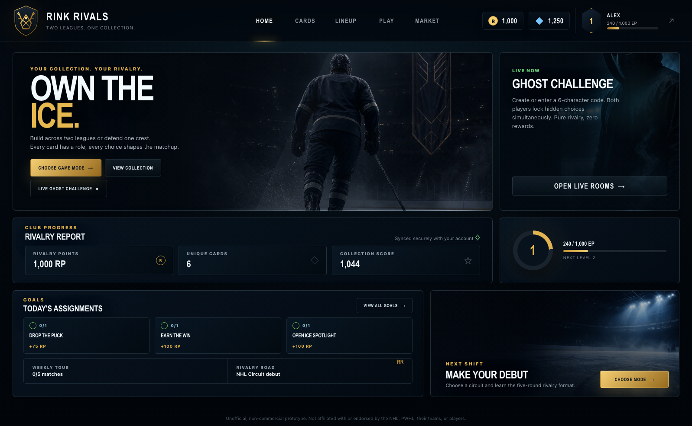
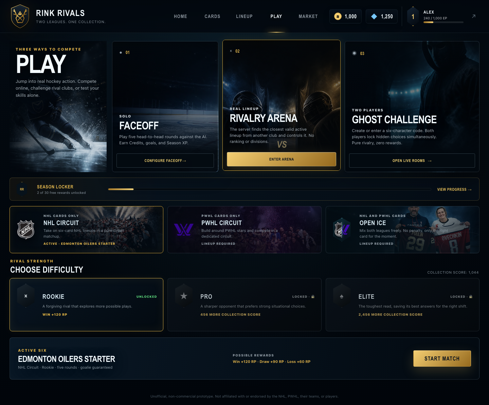
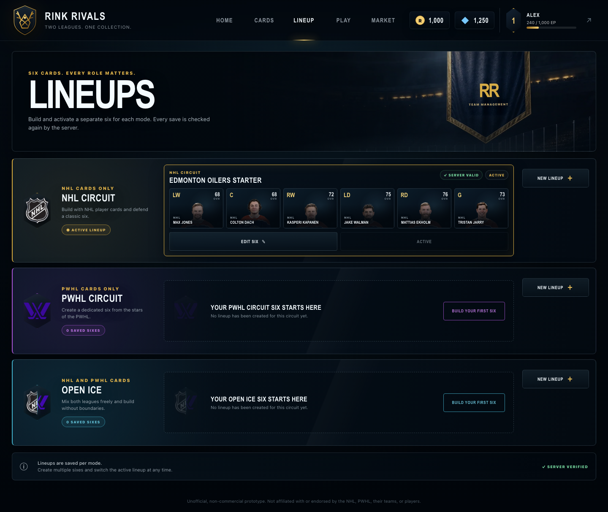
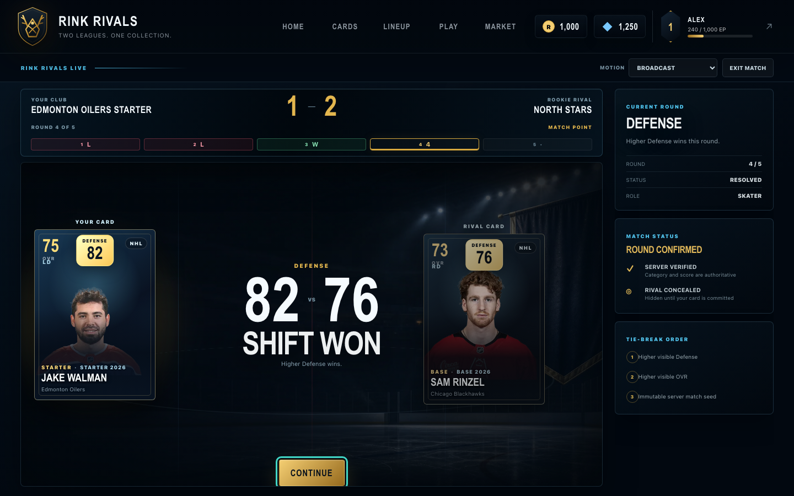
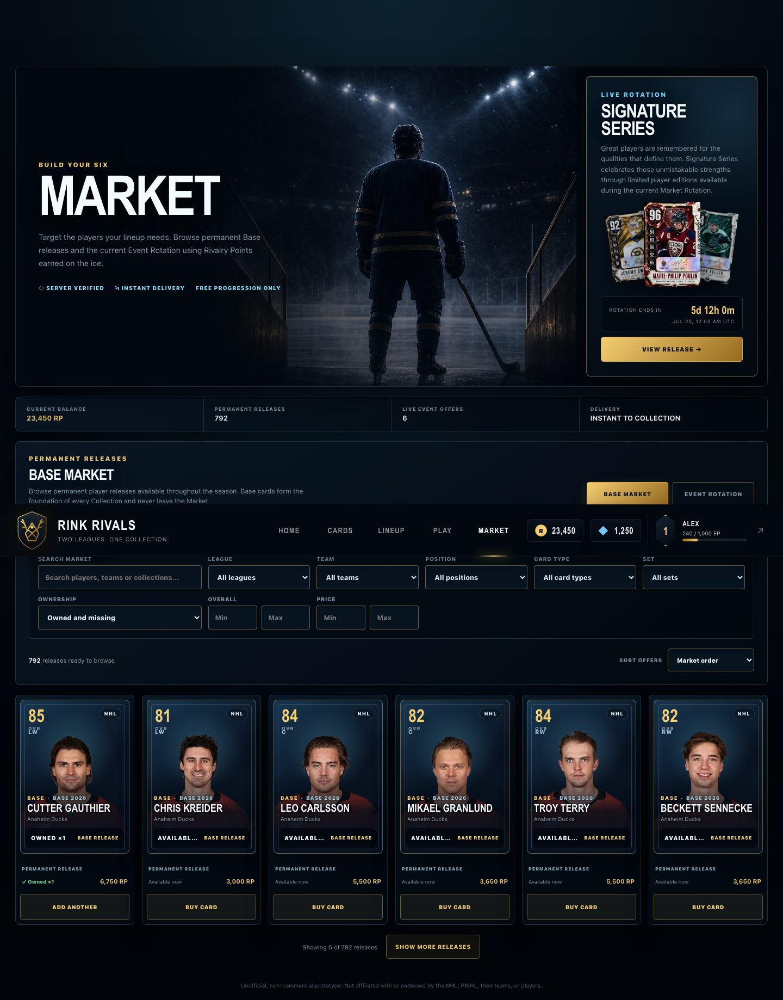
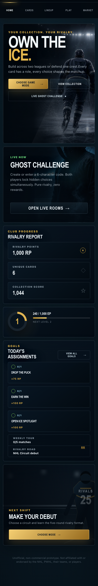

# Rink Rivals

Rink Rivals is a web-based hockey card game prototype built around collecting players, constructing six-card lineups, and making visible, category-based decisions across NHL- and PWHL-inspired circuits.

[Open the deployed demo](https://rink-rivals.vercel.app)

## Project status

Rink Rivals is an independent, non-commercial prototype under active development. A public build is deployed on Vercel, but the project is not a finished commercial game or a production-scale live service. The deployed build can also lag behind the current repository checkout.

The core account, collection, lineup, market, solo match, progression, and database-authority flows are implemented and covered by automated tests. Social competition, seasonal progression, content operations, balancing, and rights review remain active areas of development. See [MVP_STATUS.md](MVP_STATUS.md) for dated release evidence and known infrastructure findings.

## Screenshots

| Home | Play |
| --- | --- |
|  |  |

| Lineups | Match |
| --- | --- |
|  |  |

| Market | Mobile home |
| --- | --- |
|  |  |

## Core features

- **Account and onboarding flow.** Supabase Auth handles registration, sign-in, session restoration, and sign-out. A new account selects a starter team and receives an idempotent starter grant, an initial six-card lineup, and starting currency.
- **NHL and PWHL card collection.** The checked-in catalog contains separate player identities and card versions, including Starter, Base, Event, and Reward cards. Search and filters support league, team, position, rarity, ownership, and rating.
- **Three lineup circuits.** NHL Circuit accepts NHL cards, PWHL Circuit accepts PWHL cards, and Open Ice allows either league without a mixing penalty. Each lineup uses LW, C, RW, LD, RD, and G slots with ownership, role, position, uniqueness, and league validation.
- **Transparent five-round matches.** Each round announces one printed category before the player commits a card. Higher category value wins; ties use visible OVR and then an immutable server-seed decision. Four skater rounds and one goalie round make every lineup role relevant.
- **Solo Faceoff.** Players compete against deterministic Rookie, Pro, or Elite AI. Difficulty changes opponent quality and decision policy, not the visible comparison rules. Settlement grants server-calculated currency and progression exactly once.
- **Rivalry Arena.** The server selects a compatible active lineup from another account, snapshots it, and lets the Pro AI control it. This is asynchronous competition rather than public matchmaking or a ranked ladder.
- **Private and asynchronous challenges.** Live Ghost uses private six-character rooms for two authenticated players making concealed simultaneous choices. Finished solo matches can also become fixed, shareable Ghost Rivalries with expiring links. These challenge modes deliberately grant no economy or progression rewards.
- **Market and event rotation.** Base cards remain permanently available, while Event offers follow deterministic server-time rotations and availability windows. Prices, balances, ownership, and purchase idempotency are validated in Postgres.
- **Objectives and Rivalry Road.** Daily and weekly goals, collection score, match progress, unlock thresholds, and a one-time reward-card choice create progression beyond individual matches.
- **Season Locker.** A 28-day, 30-tier free reward path tracks Season XP from Faceoff and Rivalry Arena. Claims are receipt-backed and retry-safe; there is no paid track, premium currency, or random reward mechanic.
- **Responsive PWA interface.** The Vite PWA build includes a manifest and generated service worker. Layouts cover phone, short landscape, tablet, and desktop, with safe-area handling, keyboard focus states, touch-sized controls, and reduced-motion behavior.

## Product concept

Rink Rivals explores what happens when a hockey collection is treated as a decision system rather than a static card gallery. Players must build legal lineups, understand the value of different roles, commit limited cards to visible categories, and decide how to grow their club through the market and progression systems.

NHL and PWHL content are modeled as equal parts of the same game. Dedicated circuits preserve league-specific team building, while Open Ice makes mixed collections useful without imposing a league penalty. The current format intentionally stays compact: six-card lineups and five direct comparisons make the rules readable and keep each decision consequential.

## Architecture

- **Frontend:** React 19, TypeScript, Vite, React Router, CSS Modules, XState, Motion, and an optional lazy-loaded Rive presentation adapter.
- **Backend:** Supabase Auth plus PostgreSQL functions exposed through a typed repository layer. Vercel functions render public challenge pages and Open Graph images.
- **Database:** Additive SQL migrations define catalog data, account state, RLS policies, idempotency receipts, matches, progression, seasons, and competition rooms.
- **Local persistence:** Dexie stores local preferences, compatibility state, and resumable presentation data only. It cannot restore authoritative account balances, ownership, lineups, or rewards.
- **Deployment:** Vercel builds the Vite application with an environment-safety gate and rewrites public challenge URLs through server functions.
- **Testing:** Vitest and Testing Library cover domain, component, adapter, and tooling behavior; pgTAP covers database functions and policies; Playwright covers complete browser flows across four viewport profiles.

### Authority boundary

Supabase is the source of truth for profiles, currency, owned cards, lineups, purchases, match tickets and rounds, objectives, Rivalry Road, Season XP, rewards, and social competition state. Browser requests never provide a trusted price, reward amount, round result, or balance.

Protected mutations derive the user from `auth.uid()`, validate ownership and legal state in Postgres, and use request IDs or unique receipts where retries could otherwise duplicate a purchase, reward, choice, or settlement. UI components consume these operations through `SupabaseAccountRepository` instead of writing directly to protected tables.

The pure TypeScript domain modules remain independent of React and Supabase where practical. This keeps lineup rules, card comparisons, seeded behavior, economy calculations, and progression logic testable without a browser.

## Tech stack

| Area | Technologies |
| --- | --- |
| Application | React 19, TypeScript 5, Vite 7, React Router 7 |
| State and motion | XState 5, Motion, Rive WebGL2 adapter |
| Styling | CSS Modules, shared design tokens |
| Backend | Supabase Auth, PostgreSQL, Row Level Security, SQL RPCs |
| Validation and persistence | Zod, Dexie |
| Testing | Vitest, Testing Library, pgTAP, Playwright |
| Delivery | Vercel, Vite PWA |
| Package manager | pnpm 11 |

## Local development

### Requirements

- Node.js 22 or newer
- pnpm 11 (the repository declares `pnpm@11.7.0`)
- A Docker-compatible container runtime for the local Supabase stack

### Installation

```sh
git clone https://github.com/janne1945/rink-rivals.git
cd rink-rivals
pnpm install --frozen-lockfile
```

### Environment variables

Copy the public environment template:

```sh
cp .env.example .env.local
```

Then provide the Data API values printed by the local Supabase CLI or the public values from a hosted Supabase project:

```env
VITE_SUPABASE_URL=https://your-project-ref.supabase.co
VITE_SUPABASE_PUBLISHABLE_KEY=your-publishable-key
```

Only a Supabase publishable key, or a legacy `anon` key, belongs in browser-visible `VITE_` configuration. Never use a secret key, database password, or `service_role` credential. `pnpm env:check` validates the values without printing them.

### Start the application

Start Supabase, replay the checked-in migrations on the local database, and launch Vite:

```sh
pnpm supabase:start
pnpm exec supabase db reset
pnpm dev
```

The application is available at <http://localhost:5173>. Supabase Studio is configured at <http://localhost:54323>.

To inspect a production build locally:

```sh
pnpm build
pnpm preview
```

## Database and migrations

Migrations live in [`supabase/migrations`](supabase/migrations) and are applied in timestamp order. They include schema changes, RLS policies, protected functions, generated content projections, and additive hardening changes. Database regression tests live in [`supabase/tests`](supabase/tests).

For a clean local replay:

```sh
pnpm exec supabase db reset
pnpm supabase:test
pnpm supabase:types
```

Regenerate [`src/infrastructure/supabase/database.types.ts`](src/infrastructure/supabase/database.types.ts) after verified schema changes. Content projected into SQL is drift-checked separately with `pnpm catalog:sql:check`.

> **Safety:** `supabase db reset` is intended for the local container stack and destroys data in that local database. Do not use it against a hosted project. Review diffs, backups, migration history, and a linked dry run before applying hosted schema changes.

More detail is available in [the Supabase migration and security notes](docs/supabase-migration.md).

## Testing and quality checks

```sh
pnpm typecheck             # TypeScript project references
pnpm test                  # Vitest unit, component, adapter, and tooling tests
pnpm test:e2e              # Playwright against the development server
pnpm test:e2e:production   # gated production build plus Playwright
pnpm supabase:test         # pgTAP suite on local Supabase
pnpm catalog:generate:check
pnpm catalog:validate
pnpm assets:validate
pnpm catalog:sql:check
pnpm balance
pnpm build
```

`pnpm qa:core` runs the principal catalog, type, Vitest, asset, SQL-projection, balance, and build checks as one local gate. Playwright is intentionally separate and uses a stateful Supabase HTTP test double for deterministic browser coverage. pgTAP remains necessary for the real PostgreSQL functions and RLS policies.

There is currently no dedicated lint script in `package.json`. TypeScript, tests, validators, and production builds provide the configured static and behavioral checks.

## Content workflow

The application does not scrape or download league statistics at runtime. An approved source snapshot and reviewed overrides are checked into `data/content`; deterministic scripts then generate the TypeScript catalog and its SQL projection.

The current generated catalog contains 44 active teams, 792 usable player identities plus two inactive legacy-retained identities, 264 Starter cards, 792 Base cards, 107 Event cards, and 15 Reward cards. These values are asserted by repository tests rather than maintained as display-only documentation.

See [the content data-source notes](docs/content-data-sources.md), [asset pipeline](docs/asset-pipeline.md), and [script reference](scripts/README.md) before changing catalog or player-art data.

## Project structure

```text
api/                    Vercel challenge page and Open Graph functions
data/content/           reviewed source snapshots, overrides, and provenance
docs/                   architecture, gameplay, data, and UI review notes
public/assets/          runtime UI and player-card assets
scripts/                content generation, validation, and diagnostics
src/
  app/                  application shell, routing, and design tokens
  components/           reusable catalog controls
  data/                  validated and generated game catalog
  domain/                pure battle, card, economy, lineup, shop, and progression rules
  features/              account, collection, lineup, market, match, and competition screens
  infrastructure/       Supabase and local-persistence adapters
  shared/                shared card, button, clock, and formatting components
supabase/
  migrations/           additive PostgreSQL migrations
  tests/                pgTAP database and RLS regression tests
tests/e2e/               Playwright user-flow coverage
```

## Design system

Rink Rivals uses a dark sports-broadcast visual language with ice-blue surfaces, restrained gold focus accents, dense card compositions, and large game-menu stages. NHL Circuit, PWHL Circuit, and Open Ice receive distinct imagery and accents while sharing the same components, spacing system, and interaction rules.

The interface is rendered from real React components; atmospheric artwork is used for backgrounds, card art, and promotional framing rather than as flattened functional UI. Shared tokens define color, typography, radii, and surfaces. Responsive styles account for narrow phones, short landscape screens, tablets, desktop widths, safe areas, touch targets, visible keyboard focus, and `prefers-reduced-motion`.

## Known limitations

- The project is a prototype and has not been proven at commercial traffic, moderation, support, or operations scale.
- The public deployment may not represent the latest repository checkout.
- Public matchmaking, rankings, chat, clans, trading, auctions, and real-money systems are intentionally outside the current product boundary.
- Live Ghost is a private two-player room system, not a general matchmaking service; Rivalry Arena is asynchronous and unranked.
- Balance is simulation-tested but remains subject to iteration as catalog content and player behavior change.
- The deferred generated catalog exceeds Vite's default uncompressed chunk-size advisory, although it is code-split from the initial shell.
- A clean migration replay requires a local Docker-compatible runtime. Hosted-schema tests and linked checks do not replace that fresh-database proof.
- Player names, statistics, roster status, photographs, league references, and related marks require continued editorial and rights review before any broader or commercial release. Neutral fallbacks remain part of the asset pipeline.
- The repository does not currently include a license file.

## Roadmap

Near-term work is deliberately focused on the existing product:

- harden and simplify the Supabase security and migration surface;
- keep the core match, reconnect, abandonment, and settlement flows stable;
- expand automated regression coverage as social modes evolve;
- improve collection, market, and responsive UX without forking domain rules;
- reduce catalog delivery cost and document the data model further;
- complete content, roster, asset-source, and rights review for a durable portfolio/demo release.

## Disclaimer

Rink Rivals is an unofficial, non-commercial fan project. It is not affiliated with, endorsed by, or sponsored by the NHL, the PWHL, their teams, players, partners, or rights holders. Names, statistics, imagery, league references, and other identifying material remain subject to their respective rights and are included only within the project's prototype and portfolio context.

## Portfolio context

Rink Rivals was designed and developed independently as a hands-on exploration of product design, game-system design, responsive frontend architecture, server-authoritative validation, content tooling, testing, and deployment.

Project owner: [@janne1945](https://github.com/janne1945)
